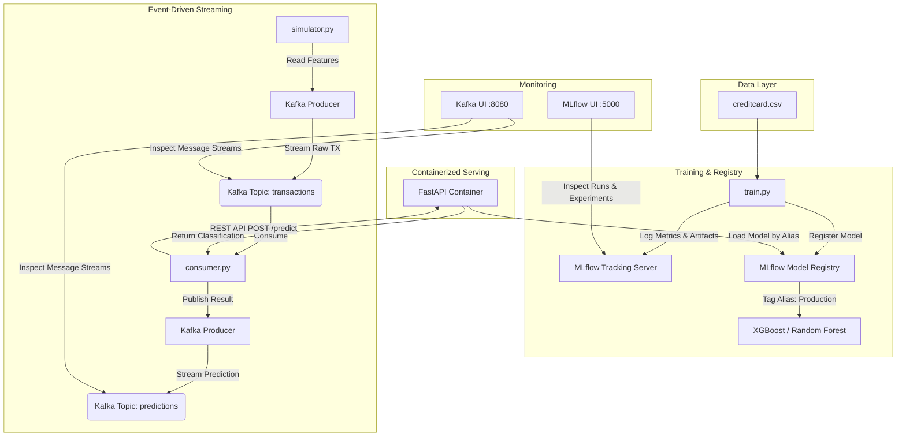

# RealGuard: Real-Time ML-Powered Fraud Detection Platform

RealGuard is a complete, production-ready Machine Learning Operations (MLOps) platform designed to detect credit card fraud in real-time. It features an automated ML pipeline, model tracking and registry with MLflow, containerized serving with FastAPI and Docker, and a decoupled event-driven streaming pipeline powered by Apache Kafka.

---

## 🏗️ Architecture



---

## 📁 Project Structure

```text
RealGuard/
├── app/                      # FastAPI Serving Layer
│   ├── config.py             # App environment and MLflow config
│   ├── main.py               # REST endpoints definitions (FastAPI app)
│   ├── predictor.py          # Prediction logic fetching registered model
│   └── schemas.py            # Pydantic input/output validation schemas
├── data/                     # Data directory (ignored from Git)
│   ├── raw/
│   └── processed/
├── kafka/                    # Event-driven Streaming Components
│   ├── consumer.py           # Consumes transactions, calls API, produces predictions
│   ├── producer.py           # Helper class wrapping KafkaProducer
│   └── simulator.py          # Streams creditcard dataset rows to Kafka
├── ml/                       # Machine Learning Pipeline
│   ├── train.py              # MLflow-integrated training script
│   └── evaluate.py           # Validation & evaluation scripts
├── Dockerfile                # API server container specification
├── docker-compose.yml        # Orchestration (API, MLflow UI, Kafka KRaft, Kafka UI)
├── requirements.txt          # Python project dependencies
└── README.md                 # Project documentation
```

---

## ⚙️ Setup & Installation

### Prerequites
* Python 3.10 or 3.11
* Docker Desktop (with WSL2 integration enabled on Windows)
* Git

### Local Environment Configuration
1. Clone the repository:
   ```bash
   git clone https://github.com/Mohith-11/RealGuard.git
   cd RealGuard
   ```

2. Create a virtual environment and activate it:
   ```powershell
   python -m venv venv
   # On Windows:
   .\venv\Scripts\activate
   # On Linux/macOS:
   source venv/bin/activate
   ```

3. Install project dependencies:
   ```bash
   pip install -r requirements.txt
   ```

---

## 🚀 Running the Platform

### Phase 1: Train & Register the Model
Run the model training pipeline locally from the `ml/` subfolder. This script automatically trains XGBoost and Random Forest classifiers, logs metrics and artifacts to MLflow, registers the best-performing model, and marks it with the `"Production"` model alias.

```bash
cd ml
python train.py
```

### Phase 2: Start the Container Services
Start the serving layer API, MLflow dashboard, Kafka KRaft broker, and Kafka Web UI using Docker Compose:

```bash
# Return to project root directory
cd ..
docker compose build
docker compose up -d
```

> [!NOTE]  
> The Docker container creates a symbolic directory link mapping (`/C:...`) internally to resolve host-specific SQLite paths written in the MLflow database during Windows-based training.

Verify that all 4 containers are healthy and running:
* **FastAPI Serving Endpoint**: `http://localhost:8000/docs` (interactive Swagger UI)
* **MLflow Tracking UI**: `http://localhost:5000`
* **Kafka UI Console**: `http://localhost:8080`

### Phase 3: Run the Real-Time Streaming Pipeline
Once the containers are up, you can run the event-driven simulation pipeline.

1. **Start the Fraud Consumer**:
   Open a terminal, activate your virtual environment, and launch the consumer script. It will listen on the `transactions` topic, call the containerized API, and publish predictions to the `predictions` topic.
   ```bash
   python kafka/consumer.py
   ```

2. **Start the Transaction Simulator**:
   Open a separate terminal, activate the virtual environment, and launch the simulator to start streaming transactions from your dataset:
   ```bash
   python kafka/simulator.py
   ```

---

## 🔍 Inspection & Monitoring

* Open **Kafka UI** at [http://localhost:8080](http://localhost:8080) to inspect your message flows:
  * Select **Topics** on the left menu.
  * Inspect the `transactions` topic to see raw credit card records.
  * Inspect the `predictions` topic to view real-time classification alerts, containing labels (`Fraud` vs `Legitimate`) and calculated probability metrics.
* Open **MLflow Dashboard** at [http://localhost:5000](http://localhost:5000) to review metrics, hyperparameter grids, and artifacts.
